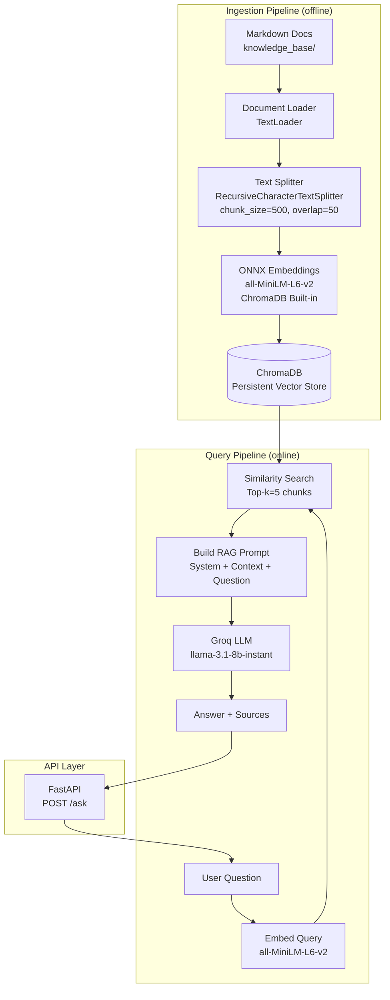

# System Design — Customer Support RAG Assistant

## Overview

This document describes the architecture of a Retrieval-Augmented Generation (RAG) system built to answer customer support questions from a company knowledge base. The system retrieves relevant documentation and uses an LLM to generate accurate, grounded answers.

---

## Architecture Diagram



---

## 1. RAG Architecture

### Ingestion Pipeline

Documents are processed offline and stored in ChromaDB before the server starts.

| Step | Component | Details |
|------|-----------|---------|
| Loading | `TextLoader` (LangChain) | Reads `.md` files from `knowledge_base/` |
| Chunking | `RecursiveCharacterTextSplitter` | chunk_size=500, overlap=50, splits on headers first |
| Embedding | ChromaDB built-in ONNX (`all-MiniLM-L6-v2`) | 384-dimensional vectors, runs via ONNX Runtime (no PyTorch), free |
| Storage | `ChromaDB` (persistent mode) | Stored on disk at `./chroma_db` |

**Why chunk at 500 characters with 50 overlap?**
Small chunks improve retrieval precision — a chunk is more likely to be topically focused. The 50-character overlap prevents answers from being cut off at chunk boundaries.

### Retrieval Strategy

Given a user query:
1. The query is embedded using the same `all-MiniLM-L6-v2` model
2. ChromaDB performs a cosine similarity search against all stored chunk vectors
3. The top-5 most similar chunks are returned

Cosine similarity is used because it measures directional alignment between vectors regardless of magnitude, making it robust for semantic search.

### LLM Generation Layer

Retrieved chunks are formatted into a prompt:

```
[System]: You are a helpful customer support assistant. Answer using ONLY the context below...

[Context]:
[Source: 02_password_reset.md]
...chunk content...

[Question]: How do I reset my password?
```

The prompt is sent to **Groq's `llama-3.1-8b-instant`** which generates a grounded answer. Temperature is set to 0.2 to favour factual, focused responses over creative ones.

---

## 2. MLOps Considerations

### Monitoring & Observability

- All queries, retrieved sources, latency, and token usage should be logged to a structured store (e.g. PostgreSQL or a logging service)
- LangSmith or OpenTelemetry can be integrated to trace the full pipeline per request
- Key metrics to track: p50/p95 query latency, retrieval hit rate, answer relevance scores over time

### Re-embedding Pipeline

When documents are updated:
1. New or changed `.md` files are placed in `knowledge_base/`
2. `rag/ingest.py` is re-run to rebuild the ChromaDB collection
3. This can be automated via a CI/CD trigger (e.g. GitHub Actions on push to `knowledge_base/`)

For incremental updates (large doc sets), only changed documents need to be re-embedded by tracking file hashes.

### Versioning

- Embedding model version and chunk settings are pinned in `config.yaml`
- ChromaDB collections can be versioned by name (e.g. `support_docs_v2`) to allow rollback
- LLM model is swappable via config with no code changes

### Deployment Strategy

- **Docker**: The FastAPI app is containerized. ChromaDB data is mounted as a Docker volume for persistence
- **Render**: Deployed as a Docker service. Environment variables (API keys) set via Render dashboard
- **Ingestion**: Run once before deploying, or as a startup task via an init container

---

## 3. Scaling Considerations

### Large Document Ingestion

- For 10,000+ documents, use batch embedding with rate limiting and parallel workers
- ChromaDB can handle millions of vectors; for extreme scale, switch to a managed vector store (Pinecone, Weaviate) with distributed indexing
- Document ingestion should be asynchronous and resumable

### Latency Optimization

- Load the ChromaDB vectorstore once at server startup (already implemented via FastAPI lifespan)
- Cache embeddings for frequently asked questions using Redis or an in-memory LRU cache
- Use streaming responses (`StreamingResponse`) for long answers to reduce time-to-first-byte

### Caching

- Cache query → answer pairs for identical or near-identical questions
- Near-duplicate detection: if query cosine similarity to a cached query exceeds 0.97, return the cached answer
- Cache TTL should reflect how often the knowledge base changes

---

## 4. Evaluation

### Retrieval Quality

| Metric | How We Measure |
|--------|---------------|
| Context Recall | % of test questions where the expected source doc appears in top-k results |
| Cosine Similarity | Average similarity between query vectors and retrieved chunk vectors |

Our current system achieves **100% context recall** on 20 test questions.

### Answer Quality

| Metric | How We Measure |
|--------|---------------|
| Answer Relevance | LLM-as-judge: does the answer address the question? (0–1) |
| Faithfulness | LLM-as-judge: is the answer grounded in the retrieved context? (0–1) |

Current results: **89.3% answer relevance**, **95% faithfulness**.

### Evaluation Pipeline

`eval/evaluate.py` runs automatically against `eval/test_questions.json` (20 curated Q&A pairs). This should be run after any change to chunking strategy, embedding model, or LLM to detect regressions.
